# Estate composition — you built the organs, this assembles the organism

HOSPES (Latin: *guest* **and** *host*; blueprint working alias:
*conversation-operations-system*, used once and never again) is not a greenfield build. The
GitHub estate already contains most of the horizontal machinery of a media company. What was
missing is the **podcast-specific domain kernel** that composes those systems into one product.

> You have built the organs. HOSPES assembles the organism.

HOSPES stays thin: it owns the domain contracts, the appearance lifecycle, the permission model,
the event bus, and the human-approval gates. Every estate system is reached only through an
adapter and a bounded event seam (see [`../adapters/README.md`](../adapters/README.md)). Nothing
is merged in; nothing is deleted; "archive/fold" means preserve and redirect.

## 1.0 runtime and provider boundary

The composition boundary is selected by `config/runtime.yaml` and each show configuration.
Local, tunnel, hosted, and hybrid profiles coexist. Calendar, tour intelligence, analytics,
research, distribution, Asset Amplifier, and mail drafting are provider registries with ordered
failover; manual, fixture, local, and live adapters remain visible in capability reports. A live
credential reference is not an authenticated receipt. Until the credential wall and smoke test
exist, the provider is reported as blocked and the operator can use the configured manual/local
fallback. External systems remain adapters; their source implementations are not copied here.

## Canonical target architecture

```mermaid
flowchart LR
    subgraph PRE["Guest intelligence & relationship"]
        AP["application-pipeline\nscore + lifecycle"]
        NG["network_graph.py\nweak-tie paths"]
        CRM["ContactsService\ncontacts + activities"]
    end

    subgraph OPS["Guest operations"]
        MAIL["universal-mail\ntriage + approvals"]
        CAL["scheduling adapter\nreal calendar + studios"]
        PORTAL["guest portal\nintake + consent + care"]
    end

    subgraph PROD["Production & editorial"]
        CAP["multi-camera framework\ncapture profile"]
        ARK["media-ark\ncanonical masters"]
        SALON["salon-archive\nconversation record"]
        LING["LingFrame\ntranscript intelligence"]
        MAT["materia-collider\nclip ledger + EDL"]
        EDIT["editorial standards\nepisode + evidence gates"]
    end

    subgraph YIELD["Content & distribution"]
        AMP["asset-amplifier\ncontent yield"]
        VOX["Vox\nvoice validation"]
        ANN["announcement templates\nchannel payloads"]
        SOCIAL["social-automation\ndispatch + receipts"]
    end

    subgraph CONTROL["Control plane"]
        DOMAIN["HOSPES domain kernel"]
        HITL["approval + audit + policy"]
        OP["operator dashboard"]
    end

    AP --> DOMAIN
    NG --> DOMAIN
    CRM --> DOMAIN
    DOMAIN --> MAIL
    MAIL --> CAL
    CAL --> PORTAL
    PORTAL --> CAP
    CAP --> ARK
    ARK --> SALON
    SALON --> LING
    LING --> MAT
    MAT --> EDIT
    EDIT --> AMP
    AMP --> VOX
    VOX --> ANN
    ANN --> SOCIAL

    DOMAIN <--> HITL
    OP <--> HITL
    HITL -. approval gates .-> MAIL
    HITL -. approval gates .-> CAL
    HITL -. approval gates .-> EDIT
    HITL -. approval gates .-> SOCIAL
```

The central object is **`AppearanceOpportunity`**, not `Guest` and not `Lead` — a person may
decline one episode, accept a later one, appear on the flagship and separately on the field
show, be reached via a publicist once and directly another time. The lifecycle, not the person,
is the durable record.

## The hidden discovery: application-pipeline → guest booking

The repository most structurally relevant to guest booking is **application-pipeline** — an
opportunity state machine with scoring, funnel/velocity analytics, a relationship CRM, and a
weak-tie network graph with proximity scoring. Its application lifecycle maps almost 1:1 onto the
guest appearance lifecycle. The terminology changes:

| Existing application term | HOSPES podcast term |
|---|---|
| Application | Appearance opportunity |
| Target organization | Guest, representative, institution, or network |
| Qualified | Editorially approved |
| Drafting | Outreach being prepared |
| Submitted | Outreach sent (human-gated) |
| Acknowledged | Reply received |
| Interview | Recording |
| Outcome | Booked, declined, revisit, published |
| Network proximity | Least socially expensive credible route |

This is not merely analogous — much of the logic is extractable into `@hospes/network-graph`.

## The mirror-mirror honesty note

`mirror-mirror` contains a genuine booking-interface prototype (Booking, GroupBooking,
CalendarSync, AppointmentReminders, reminderScheduler — all confirmed in the local checkout). But
it must be classified honestly: **it is a rich prototype, not a production scheduler.** Booking
uses hard-coded providers and simulated confirmation timing; CalendarSync uses mock events and a
simulated connection; reminderScheduler runs on a browser interval over Spark KV.

> **Extract the interaction design and schemas; rewrite the infrastructure.**

At HOSPES-adapter time: hard-coded providers → hosts/guests/producers/studios; mock availability
→ real free/busy; single calendar → host + studio + guest + crew; browser timer → durable
worker; Spark KV → a durable store. (In v0, the durable store stays stdlib + YAML under `out/`.)

## Disposition table

"Archive/fold" = preserve and redirect, never delete.

| Disposition | Systems |
|---|---|
| **Retain as services** | content-engine--asset-amplifier, universal-mail--automation, media-ark, social-automation, multi-camera--livestream--framework |
| **Extract as packages** | application-pipeline (CRM + network graph), public-record-data-scrapper (contact service shell), mirror-mirror (scheduling UX/schema), persona-voice-governance (vox--architectura-gubernatio + vox--publica), materia-collider (clip ledger) |
| **Adapt as domain specs** | salon-archive, praxis-perpetua + object-lessons, community-hub, collective-persona-operations, aerarium (framing only) |
| **Preserve as advanced R&D** | speech-score-engine, sign-signal--voice-synth, vox (voice synth core) |
| **Fold / archive as precursors** | kerygma-pipeline, a-i-council--coliseum |

## Remaining genuinely new work (8 items) — v0 coverage vs later

The estate does not contain a podcast product; these must be built deliberately. Each is mapped to
whether HOSPES v0 already covers it or defers it.

| # | New work | HOSPES v0 covers | Deferred to later |
|---|---|---|---|
| 1 | Podcast-domain contracts (people, relationships, opportunities, episodes, studios, commitments, consent, assets, sponsors, approvals) | **Yes** — `spec/` domain contracts + appearance state machine | production DB backing |
| 2 | Permissioned relationship ownership (Ari designates friends, protected relationships, allowable routes, whether his name may be invoked) | **Yes** — relationship classes C0–C5 + protect/route policy in domain + operator approval | UI polish |
| 3 | Real scheduling infrastructure (host/studio/guest free-busy, durable reminders, three-city routing) | **Partial** — studio objects + LA/NYC/Austin routing logic + reminder *schema* | real Google Calendar free/busy, durable worker (network — later) |
| 4 | Guest portal (intake, releases, accessibility, hospitality, tech reqs, transport, shipping consent) | **Partial** — intake + consent *contracts* and day-of packet | hosted portal UI |
| 5 | Cross-show tenancy (flagship, field show, outside customers; explicit per-show permission for shared relationships) | **Partial** — Show DNA config + tenant/show entities + per-show route permission | billing, onboarding, isolation hardening |
| 6 | Sponsor-creative governance (approved/prohibited claims, script versions, disclosures, approvals, results) | **Partial** — sponsor claim/evidence + approval contract (adapts the-actual-news pattern) | performance results loop |
| 7 | Adapters (Gmail, Calendar, media archive, content engine, distribution, e-sign, gift/travel) | **Yes** — this adapter layer (18 adapter files) | live wiring of network adapters |
| 8 | One operator experience (Ari sees one concise approval surface, not the constellation) | **Yes** — the control-plane / approval-session checklist (Ari's ~10-min/week budget) | dashboard app |

## Six-step build order

0. **Lock the domain** — approve entities, events, permissions, relationship classes, state machine.
1. **Build the control plane** — operator approve / reject / protect / add-note / view-exception.
2. **Activate guest operations** — contact service + network graph + universal-mail + Gmail +
   real calendar/studio free-busy + durable reminders + guest portal.
3. **Activate episode operations** — guest dossier + claims/evidence + segment cards + day-of
   packet + salon-archive transcript model + media-ark ingest + materia-collider clip ledger.
4. **Activate content yield** — master → asset-amplifier → human clip approval → voice/editorial
   gates → announcement compilation → social-automation dispatch → delivery + performance.
5. **Prove multiple tenants** — Ari + Anthony flagship → Anthony field show → one outside
   podcaster from the network. Only then is it a generalized customer product.

## Reconciliation table — every discrepancy between the audit and ground truth

Verified independently via `gh repo view` (organvm, then 4444J99 fallback) and local `ls`. All
three sources reconciled: (1) the ChatGPT GitHub audit (`final_response.txt`), (2) the blueprint
pack (`repo_capability_matrix.csv` + `integration_manifest.yaml` + blueprint), (3) my independent
scans (`estate_scan_packets.md`).

| System (as named) | Discrepancy | Ground truth | Resolution |
|---|---|---|---|
| **aerarium** | Audit cites "Aerarium" modeling a one-principal office ("institutional weight for one person, zero staff"). **No `aerarium` repo exists** in organvm or 4444J99. | Repo search resolves only `organvm/aerarium--res-publica` = fiscal sponsorship / entity formation / grants / donor infrastructure — a *different* concern. | **verified:false.** Retain the audit's positioning *framing* only (the "invisible desk" line); do NOT extract or depend on any aerarium code. |
| **vox** vs **vox--architectura-gubernatio** | Scan's "vox" and audit's "Vox" are treated as one; they are two repos. | `organvm/vox` = voice synth CORE (clone/synth/transcribe, FastAPI, PRIVATE). `organvm/vox--architectura-gubernatio` = voice *governance* engine (PRIVATE). Both exist. | Split into two adapters: `vox.adapter.yaml` (preserve-rnd, synth core) and `persona-voice-governance.adapter.yaml` (extract-package, governance). |
| **coliseum** vs **multi-camera framework** | Scan calls `a-i-council--coliseum` "the streaming app"; audit assigns the streaming/capture role to `multi-camera--livestream--framework`. | Both repos exist and are PUBLIC. coliseum = decentralized live-stream + crypto viewer participation + Three.js. multi-camera framework = capture/studio runbook framework. Different things. | Capture role = multi-camera framework (retain-service). coliseum folded/parked (fold-archive), discrepancy recorded honestly, not wired into v0. |
| **mirror-mirror** description drift | GitHub description = "Private analytics and customer insights platform." | Local code IS a React booking app — Booking.tsx, GroupBooking.tsx, CalendarSync.tsx, AppointmentReminders.tsx, reminderScheduler.ts (+ test) confirmed. Description-vs-code drift is real. | Trust the code. extract-package (scheduling UX/schema), flagged prototype-not-production. |
| **materia-collider** description drift | GitHub description = "Pre-codified experimental space for idea collision before organ graduation." | Audit/scan capability = time-coded clip ledger with EDL export. The one-line description understates the code. | Trust the capability. extract-package (clip ledger). |
| **application-pipeline** local-path claim | Scan claims a local checkout at `~/Code/application-pipeline`. | That path is **MISSING** on disk. The repo exists (organvm AND 4444J99, PUBLIC, pushed 2026-07-13). | Trust the GitHub repo; the stale local-path claim is noted and not relied on. |
| **application-pipeline** ownership | Scan lists it as `4444J99(+organvm)`. | Confirmed present under BOTH owners with identical description. | Adapter records `organvm/application-pipeline` (also at 4444J99). No conflict. |
| **media-ark** dual home | Scan flags primary work at `4444J99/media-ark`, service at `organvm/media-ark`. | Both remotes resolve, both PRIVATE, both pushed 2026-07-13. | retain-service; adapter notes the dual home. |
| **community-hub / a-i-council--coliseum** provenance | Named only by the scan, absent from the audit's disposition table. | Both repos verified to exist (PUBLIC). | Included as `claimed_by: [local_scan]` / `[github_scan]` with honest provenance; community-hub = adapt-spec (public-face), coliseum = fold-archive. |

**Verification failures:** exactly one — `aerarium` (no matching repo; only `aerarium--res-publica`
exists, which is a different concern). Recorded as `verified:false` in `aerarium.adapter.yaml`.
Every other named system was verified to exist via `gh repo view` and/or local `ls`.
